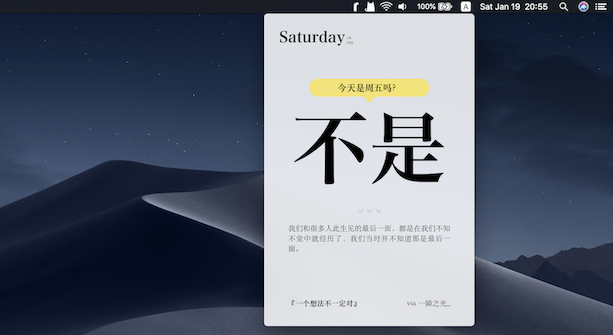
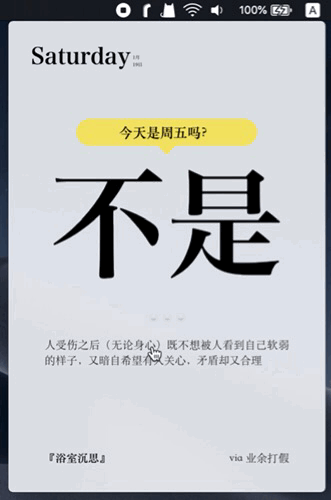
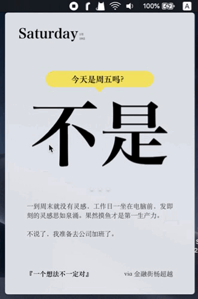

# Jike Calendar

It is a Mac calendar menubar app built with [Electron](https://github.com/electron/electron).

The idea comes from the Jike desk calendar, which is funny and looks pretty.

With the idea, I bulit a widget on iOS with [JSBox](https://itunes.apple.com/cn/app/jsbox-learn-to-code/id1312014438?l=en&mt=8) not long ago. If interested, click [Jike Calendar](https://t.me/Flow_Script/763) for more details.

Today, this repository again copy the same idea and transfer it from iOS to MacOS (desktop) using Electron. The design of this app combines the desk calendar and the iOS implementation, looks much more similar to the real one, and much easier for desktop to use.

Two key points are kept in this version.

- Small font size is used to display the "useless" date infomation.
- Quotations posted by users are showed randomly.

If you don't have the real Jike desk calendar but love it and want one, you should take a try.

## Install

To be continued.

## Usage

Press `Space` to toggle the magnifier, it is a trick to look at a larger date 🌚.  

`Click` a quote to refresh the content, and `Scroll` it if it is overflowed.  

Press `⌘+W` to dismiss the window, and press `⌘+Q` to quit entirely.

`Right click` to popup the menu and see more informations.  

## Todo

- [ ] Design a popup view to show the entire content of a quote.
- [ ] Solve the problem of low resolution on magnifier.
- [ ] Add preferences.
- [ ] Add check for updates.
- [ ] Add share button.
- [ ] Add lunar calendar and holidays.
